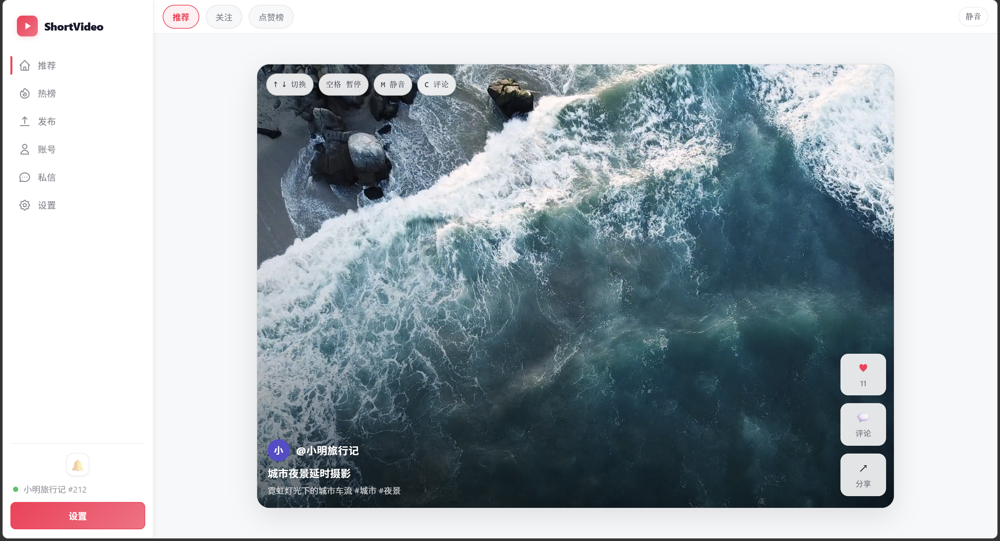
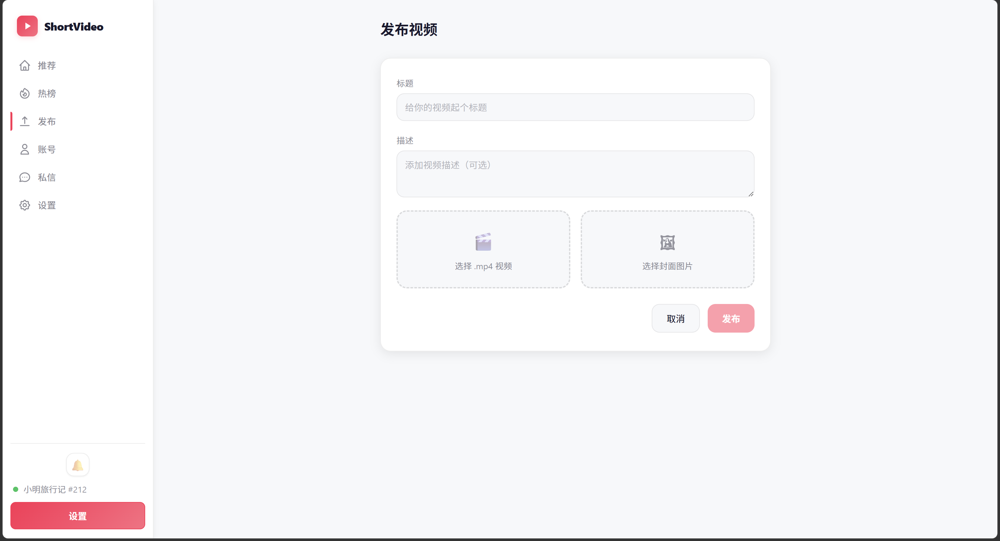
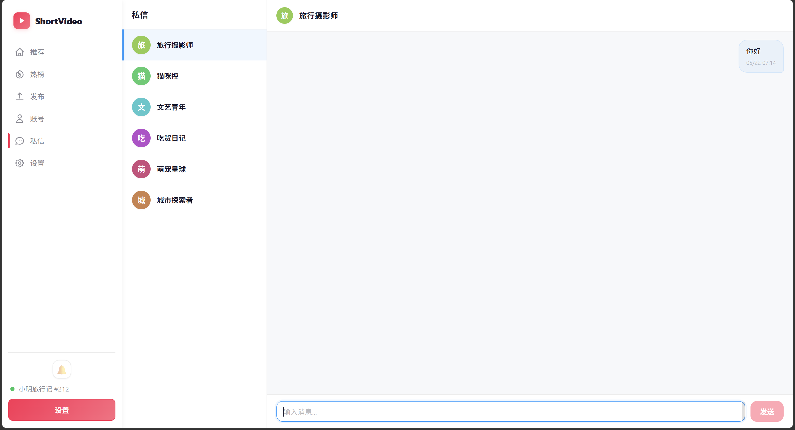
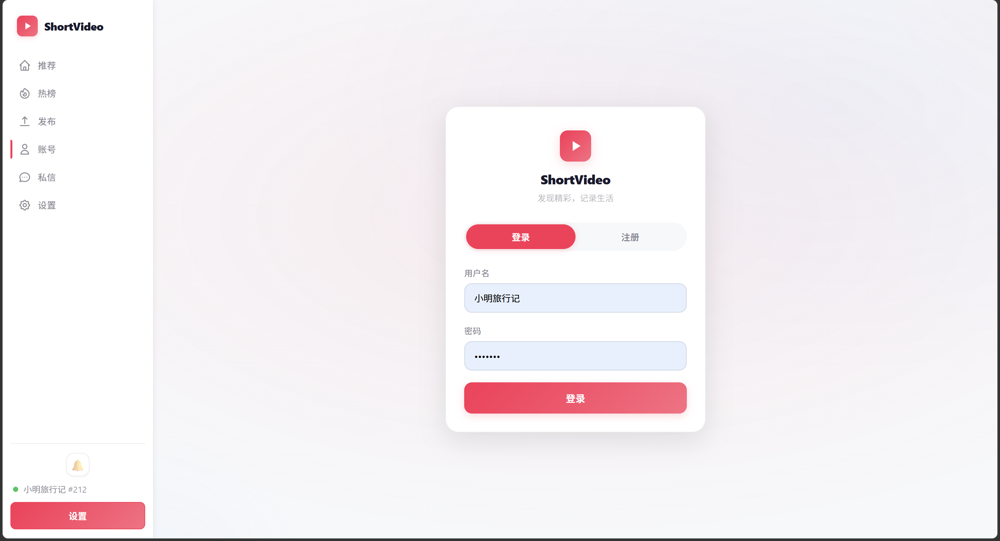
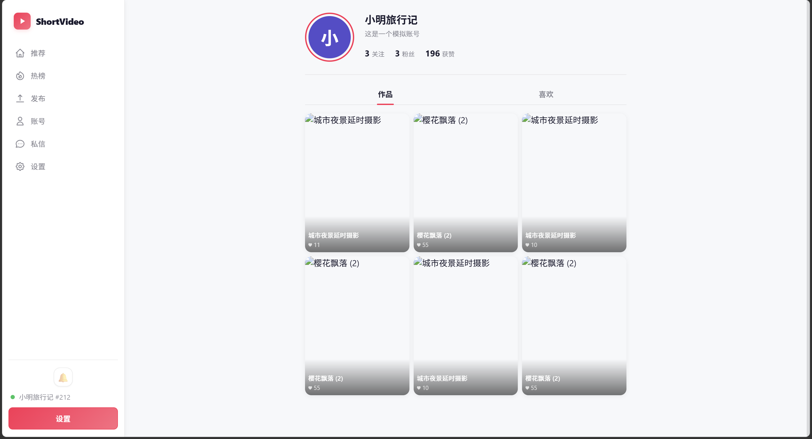
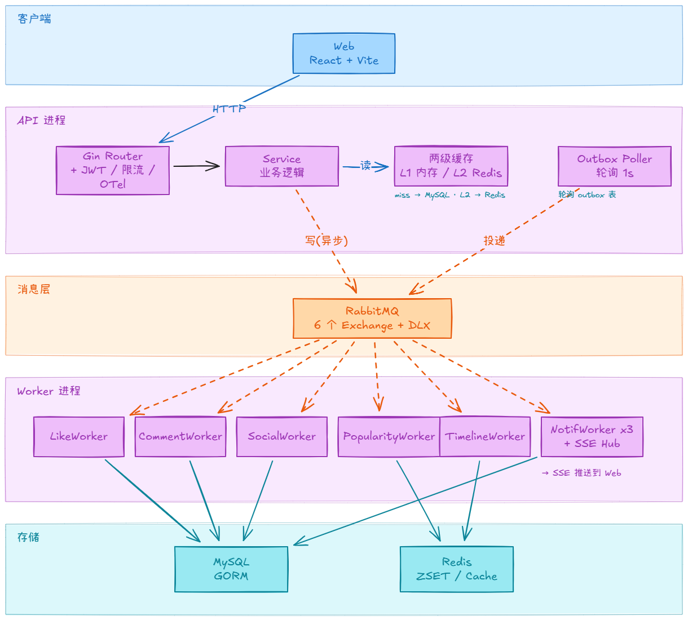

# Video Feed

类抖音短视频社区 Go 后端 — 覆盖鉴权、视频发布、多场景 Feed 流、社交互动、通知与私信。**API + Worker 双进程**，**两级缓存 + RabbitMQ 异步解耦 + Outbox 最终一致**。

> 配套项目:[video-ops-agent(短视频运营分析 Agent)](https://github.com/junnhwan/video-ops-agent) 以本项目 API 作为数据源。

## 演示

| Feed 流 | 视频发布 | 通知与私信 |
|:---:|:---:|:---:|
|  |  |  |

| 登录注册 | 个人主页 |
|:---:|:---:|
|  |  |

> 前端基于 React + Vite,完整覆盖登录注册、视频流(最新/热榜/关注)、上传、个人主页、SSE 实时通知、私信。

## 技术栈

Go 1.26 · Gin · GORM (MySQL) · go-redis (Redis) · RabbitMQ · JWT · Prometheus · Swagger · Docker Compose

## 核心亮点

- **多场景 Feed 游标分页** — 最新流(时间戳 + watermark 冷热拼接)、点赞榜(`likes_count + id` 复合游标)、热榜(快照时间戳分页)、关注流(过滤后翻页),解决无限滚动重复刷/漏刷。
- **分片 ZSET 热榜** — 热度按分钟切片写入独立 ZSET,读路径 `ZUNIONSTORE` 聚合近 60 个窗口并缓存结果;singleflight 合并并发回源。**JMeter 压测 P99 ↓ ~85%、吞吐 ↑ ~8x**。
- **Outbox + RabbitMQ 异步链路** — 视频发布同事务写表 + Outbox(轮询投递),保证 Feed 时间线不遗漏;点赞/评论等写操作经 MQ 异步落库,MQ 不可用时降级为同步写。
- **两级缓存** — L1 本地(3s)→ L2 Redis(5min~1h)→ MySQL,singleflight 合并并发回源防击穿。
- **JWT + Redis Token 白名单** — 实现服务端可控的单设备登录;Feed 接口软鉴权,未登录可浏览、登录态附带个性化数据。
- **全链路可观测** — Prometheus 指标(HTTP / 缓存 / MQ / 限流 / Outbox)、OTel 追踪、Zap 结构化日志(`trace_id` 自动注入)、Swagger、pprof。

## 架构



> 读路径:`API → L1 → L2 → MySQL`;写路径:`API → RabbitMQ → Worker → MySQL/Redis`;视频发布走 Outbox 同事务写表 + 轮询投递,保证发布即可见。

## 功能模块

| 模块 | 能力 |
|---|---|
| 账号 | 注册、登录、Token 刷新、登出、资料/头像更新、用户查询 |
| 视频 | 发布、删除、详情、作者视频列表、封面上传、标签关联 |
| 分片上传 | 初始化、分片上传、进度查询、合并完成、Hash 幂等 |
| Feed 流 | 最新流、点赞榜、热榜、标签 Feed、关注流(5 种游标策略) |
| 社交 | 点赞/取消、评论/删除、关注/取消、粉丝列表、关系计数 |
| 通知 | SSE 实时推送、通知列表、已读/未读计数 |
| 私信 | 发送消息、会话列表 |

### 异步事件(RabbitMQ)

所有队列配置 DLX 死信交换机,最大重试 3 次。

| Exchange | Worker | 职责 |
|---|---|---|
| `like.events` | LikeWorker | 点赞/取消落库 + 更新计数 |
| `comment.events` | CommentWorker | 评论发布/删除落库 |
| `social.events` | SocialWorker | 关注/取消落库 |
| `video.popularity.events` | PopularityWorker | Redis ZINCRBY 更新热度 |
| `video.timeline.events` | TimelineWorker | Redis ZADD 写入全局时间线 |
| 上述事件 + 通知绑定 | NotificationWorker ×3 | 通知落库 + SSE 实时推送 |

## 压测

JMeter A/B 对比实验,Go 工具负责造数据和切换对比状态。

```bash
# 造数据
go run ./cmd/benchseed -config configs/config.yaml -users 50 -videos 1000

# 对比运行(热榜 DB fallback vs Redis 快照)
./bench/jmeter/run-comparison.ps1 -Manifest $seed -Threads 5 -FeedThreads 5,10,20 -Duration 30 -SkipComment
```

关键结果:
- 热榜读取:DB fallback → Redis 快照,**P99 ↓ ~85%、吞吐 ↑ ~8x**
- 视频详情:冷读 → 热缓存命中,延迟显著下降
- 最新 Feed:多并发档位下游标分页稳定性验证

## 快速启动

### Docker Compose(推荐)

```bash
docker compose up -d --build
```

| 服务 | 地址 |
|---|---|
| API | http://127.0.0.1:8080 |
| Frontend | http://127.0.0.1:5173 |
| MySQL | 127.0.0.1:13306 |
| Redis | 127.0.0.1:6379 |
| RabbitMQ Management | http://127.0.0.1:15672 |
| Swagger | http://127.0.0.1:8080/swagger/index.html |

### 手动启动

依赖:Go 1.26 · MySQL · Redis · RabbitMQ。

```sql
CREATE DATABASE IF NOT EXISTS video_feed DEFAULT CHARACTER SET utf8mb4 COLLATE utf8mb4_unicode_ci;
```

```bash
export CONFIG_PATH="configs/config.yaml"
go run ./cmd/server   # API
go run ./cmd/worker   # Worker(另一个终端)
```

健康检查:`curl http://127.0.0.1:8080/health`

## 目录结构

```text
cmd/
  server/         # API 服务入口
  worker/         # MQ Worker 入口
  benchseed/      # 压测数据生成
  benchrun/       # Go 压测 runner
internal/
  account/        # 账号、资料、Token
  auth/           # JWT 工具
  feed/           # Feed 查询、游标、热榜
  http/           # Gin 路由装配
  middleware/     # JWT、Redis、RabbitMQ、限流
  observability/  # Zap、OTel、Prometheus、pprof
  social/         # 关注关系
  video/          # 视频、点赞、评论、标签、分片上传
  worker/         # 异步消费者、通知、SSE Hub
  message/        # 私信
frontend/         # React + Vite 前端
docs/             # Swagger 文档与截图
```
